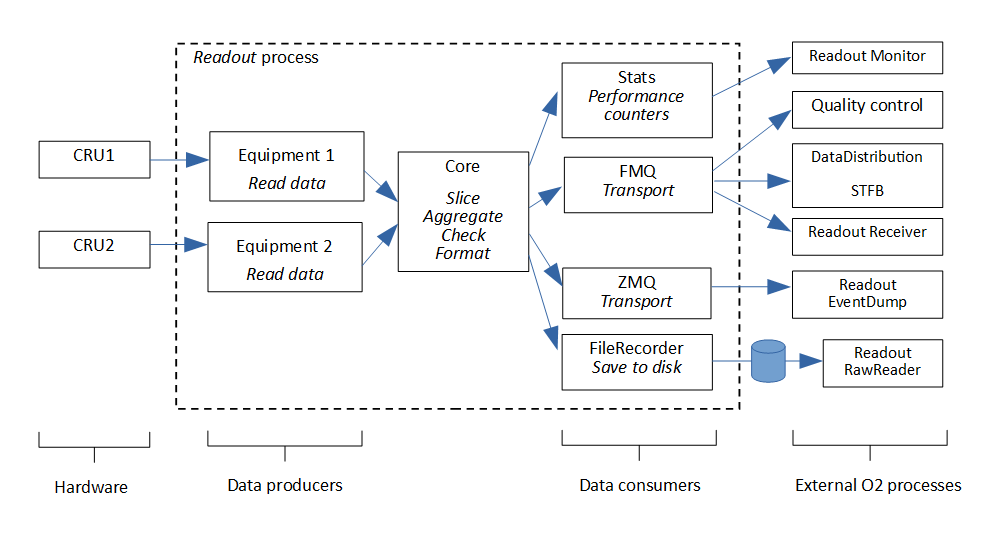

# Readout

The Readout package provides the runtime process in charge of collecting data from the readout cards on the FLPs.
It is the first executable component in the O2 dataflow chain: it streams data from the available hardware sources to O2 software devices.
It can also be configured in many ways for other purposes.


The following executables, presented with the _nicknames_ used below, are part of the Readout package:

  - [_o2-readout-exe_](#readout_1) or _Readout_: the main executable, named previously _readout.exe_. It streams data from the hardware to the O2 software.
  - [_o2-readout-config-generator_](#generator) or _Generator_: helper script to generate configuration files for _Readout_.
  - [_o2-readout-config-editor_](#editor) or _Editor_: a graphical editor to help editing configuration files.
  - [_o2-readout-eventdump_](#eventdump) or _EventDump_: a runtime data inspector, to decode/display raw data collected by _Readout_. 
  - [_o2-readout-monitor_](#monitor) or _Monitor_: a runtime monitoring tool, to check the status of _Readout_.
  - [_o2-readout-rawreader_](#rawreader) or _RawReader_: a tool to check validity and inspect content of raw data files recorded by _Readout_.
  - [_o2-readout-receiver_](#receiver) or _Receiver_ : a process to receive data from _Readout_ by FMQ, e.g. for local communication tests when STFB is not available.
  - [_o2-readout-status_] or _ReadoutStatus_: an interactive interface to displaying runtime statistics connected by _Monitor_.
  - [_o2-readout-rawmmerger_](#rawmerger) or _RawMerger_: a tool to concatenate multiple raw data files in a single file, e.g. for replay by _Readout_.

There are also some readout internal test components, not used in normal runtime conditions, for development and debugging purpose (_o2-readout-test-*_)
The source code repository is [https://github.com/AliceO2Group/Readout].

## _Setup_

To use any of the tools described here, when using the FLP suite binary packages, you need first to load the correct software environment with:

```
module load Readout
```


## _Readout_

A detailed description of _Readout_ is available in the CHEP2018 paper [Readout Software for the Alice Integrated Online-Offline (O2) System](https://doi.org/10.1051/epjconf/201921401041).

The figure below shows the data flow in _Readout_, data going from left to right.



  1. data are produced by readout equipments
  2. data are sliced, aggregated, and checked 
  3. data are distributed to consumers.

_Readout_ is a multi-threaded process implementing a data flow connecting together threads of different types (data sources, or equipments - to data sinks, or consumers) through FIFO buffers. Each thread runs in an independent loop. A main core thread takes care to distribute data between threads and to synchronize them on process startup and shutdown. 

The actual runtime components are instanciated on startup from a configuration file.  
Data is shared, each consumer may use (read-only) the incoming data before releasing it. Pushing data to consumers is by default a blocking operation (if FIFO full, _Readout_ waits until being able to push).
Backpressure is applied upstream between the readout threads (output FIFO of step N-1 is not emptied any more when input FIFO of step N full).

### Architecture

** Equipments **

Keeping the same vocabulary as in the ALICE DAQ DATE software, a readout equipment is a data source (typically, from a hardware device). It is a thread running in a loop, populating an output FIFO with new data.

The base class ReadoutEquipment is derived in different types:

  - ReadoutEquipmentDummy : a dummy software generator to push data to memory without hardware readout card.
  - ReadoutEquipmentRORC : the readout class able to readout CRORC and CRU devices, using the ReadoutCard library DmaChannelInterface for readout.
  - ReadoutEquipmentCruEmulator : a class emulating CRU data, with realistic LHC clock rates.
  - ReadoutEquipmentPlayer: a class to inject data from a file.
  - ReadoutEquipmentZmq: a class to inject data from a remotely ZeroMQ publishing service (e.g. the DCS ADAPOS server).


** Aggregator **

This is a simple loop putting in the same vector data with matching selected criteria (typically, timeframe ID, grouped for each data source). It expects for each equipment to have a monotonic increase of IDs (but not necesseraly a continuous numbering).


** Consumers **

The consumers are threads making use of the data. The following have been implemented:

  - ConsumerStats : keeps count of number and size of blocks produced by readout. Counters can be published to O2 Monitoring system.
  - ConsumerFileRecorder : writes the readout data to a file
  - ConsumerDataChecker : checks data content (header, payload). Implemented for CRU internal data generator.
  - ConsumerDataSampling : pushes data through the DataSampling interface
  - ConsumerFMQ : pushes data outside readout process as a FairMQ device.
  - ConsumerFairMQChannel : pushes data outside readout process as a FairMQ channel - with the WP5 format. This consumer may also create shared memory banks (see Memory management) to be used by equipments.
  - ConsumerTCP: pushes the raw data payload by TCP/IP socket(s). This is meant to be used for network tests, not for production (FMQ is the supported O2 transport mechanism).
  - ConsumerRDMA: pushes the raw data payload by RDMA with ibVerbs library. This is meant to be used for network tests, not for production (FMQ is the supported O2 transport mechanism).
  - ConsumerDataProcessor: allows to call a user-provided function (dynamically loaded at runtime from library) on each data page produced by readout. See ConsumerDataProcessor.cxx for function footprint and ProcessorZlibCompress.cxx for example compression implementation. Note that the option 'consumerOutput' can be useful to forward the result of this processing function to another consumer (e.g. file recorder, transport, etc). The following processor libraries are provided with Readout: libO2ReadoutProcessorZlibCompress, libO2ReadoutProcessorLZ4Compress.
  - ConsumerZMQ: pushes raw data payload by ZMQ. Used to push data to _EventDump_.
  
They all follow the interface defined in the base Consumer Class.


** Memory **

Readout creates on startup some banks (big blocks of memory), which are then used to create pools of data pages which are filled at runtime by the readout equipments (and put back in the same pool after use).

The memory layout is explicitely defined in the configuration file.

In practice, you will define one or more memory blocks to be used by the equipments. Each block is configured in a section named `[bank-...]` (e.g. `[bank-a1]`), specifying its type (e.g. `type=malloc` or `type=MemoryMappedFile`), size (e.g. `size=256M` or `size=4G`) and optionally NUMA node to be used (e.g. `numaNode=1`).

The special consumer 'FairMQChannel' may also create a memory bank, allocated from the FMQ "unmanaged shared memory" feature, before the other banks are created (and hence, being the first one, being used by default by equipments).

Each equipment will then create its private data pages pool from a given bank. This is done in the corresponding equipment configuration section with number (`memoryPoolNumberOfPages=1000`) and size of each page (`memoryPoolPageSize=512k`), and which bank to use (`memoryBankName=bank-a1`). By default of a bank name, readout will try to create the pool from the first bank available. Several memory pools can be created from the same memory bank, if space allows. There should be enough space in the pool for memoryPoolNumberOfPages+1 pages, as some space is reserved for metadata. In other words, a 1GB bank can accomodate only 1023 x 1MB pages. Page alignment settings may also reduce the usable space further.

The number of pages allocated for an equipment should be large enough to accomodate data of at least 2 subtimeframes. Otherwise, the slicing into timeframes can not work, as it holds the data of current subtimeframe until it is complete (i.e. when data from next timeframe starts to reach it). If necessary (mostly for test/debug purpose), the slicer can be disabled by setting in the configuration the global parameter `disableAggregatorSlicing=1`.

In practice, you should allocate enough buffer for several seconds, i.e. hundred(s) of subtimeframes. When you define the number of pages, take into account that the CRU stores data of different links in different pages. So the number of pages needed increases with the number of links used.


** Data format**

Readout uses a set of structures for internal indexing of the data pages. The content (payload) of the pages is not affected, and follows the RDH specification
if using a CRU equipment.

The (internal) base data type is a vector of header+payload pairs. In practice, it deals with different object types:

  - DataBlock : header+payload pair
  - DataBlockContainer : object storing a DataBlock, specialized depending on underlying MemPool, with ad-hoc release callback.
  - DataSet : a vector of DataBlockContainer
  - DataSetReference : a shared pointer to a DataSet object


### Configuration

In the O2 production system, a central configuration store is provided.
For standalone operations, Readout can use a configuration file.

The configuration source is provided as a startup argument (see 'Usage' below).

Some of the configuration parameters may be overwritten at runtime by OCC, when readout is launched from AliECS. For example, the FairMQ parameters for the StfBuilder connection are set dynamically in the configure step. This is done for the consumer with matching `fmq-name=readout`.

Some of the configuration parameters may be loaded on startup from `/etc/o2.d/readout-defaults`.


#### File syntax

Readout is configured with a ".ini"-formatted file.

The configuration file is separated in sections, starting with a section name within brackets [...]. Each section consists of a list of _key=value_ pairs.

A separate document provides the [reference of readout configuration parameters](configurationParameters.md).

Each readout component is configured in a different file section. The section name is used to get the type of the component to be instanciated.
Equipments should be prefixed as `[equipment-...]`.
Consumers should be prefixed as `[consumer-...]`.
General settings are defined in section `[readout]`.

Comments can be added by starting a line with the &#35; sign. Inline comments (&#35; later in the line) are not accepted. 
Documented example files are provided with the source code and distribution.

To setup a new readout configuration starting from the provided file, the basic steps are:

- define a memory layout suitable for your readout.
- define the equipments to be used, and their parameters (in particular, the memory bank they should use. If not specified, readout will use the first one available).

#### Generator

A command line utility is provided to generate a configuration file corresponding
to current detected system configuration (memory, NUMA, CRUs, CRORCs):

```
Usage: o2-readout-config-generator
List of options:
    -o filePath: path to a configuration file to be written.
                 If none provided, template is printed on console (after system config info).
```    

#### Editor

A graphical configuration editor is provided to view and edit readout configuration files.
Documentation of the parameters is available by right-clicking in any value field.

```
Usage: o2-readout-config-editor myConfigFile.cfg
```


### Usage

Readout can be launched from a terminal. It takes as argument the name of the configuration file to be used:

 `o2-readout-exe file://path/to/my/readout.cfg`

This parameter can also be a URI for the O2 Configuration backend
(with as optional extra parameter the entry point in the configuration tree, by default empty, i.e. top of the tree)

  `o2-readout-exe ini://path/to/my/readout.ini`
  `o2-readout-exe consul://localhost:8500 /readout`

Readout implements the [state machine](https://github.com/AliceO2Group/Control/tree/master/occ#the-occ-state-machine) defined by the O2 control system (OCC).

By default, Readout starts as a standalone process, and automatically executes the state transitions to start taking data.
It stays in the "running" state until an exit condition occurs, which can be one of:

  - external signal received (SIGTERM/SIGQUIT/SIGINT), which can e.g. be triggered by interactive CTRL+C or kill command
  - timeout, if configured (see [exitTimeout](configurationParameters.md) parameter).

It then stops data taking, releases the resources, and exits.

When the environment variable OCC_CONTROL_PORT is defined, Readout is controlled by OCC, and waits external control commands to change state.
To launch Readout in this mode, simply set the variable, e.g. 
  `export OCC_CONTROL_PORT=47100`
For testing this mode, one can use the [peanut](https://github.com/AliceO2Group/Control/tree/master/occ#the-occ-state-machine) utility to send commands.

It is also possible to run directly the readout state machine interactively (with keyboard commands to request state transitions).
To do so, set environment variable O2_READOUT_INTERACTIVE before starting the process. When defined, this supersedes the OCC mode.

Readout logs are written to the InfoLogger system. When Readout (or other utility) is started from a terminal, the logs are printed to the console 
(unless O2_INFOLOGGER_MODE environment variable already specifies a log output).


## Monitor

Requires _Readout_ to have the Stats consumer configured to publish data by ZMQ.
It displays statistics on various internal readout counters and buffers status.
Unless specified from the command line, parameters are loaded from readout defaults file.

```
o2-readout-monitor
```

When stats are broadcasted (c.f.  readout-monitor.broadcastPort/broadcastHost parameters), they can also be displayed by interactive front-end for P2:

```
o2-readout-status
```


## RawReader

This is a console utility to check/display content of data files recorded with Readout (consumerType=fileRecorder).
  
```
Usage: o2-readout-rawreader [rawFilePath] [options]
List of options:
     filePath=(string) : path to file
     dataBlockEnabled=0|1: specify if file is with/without internal readout data block headers
     dumpRDH=0|1 : dump the RDH headers
     validateRDH=0|1 : check the RDH headers
     checkContinuousTriggerOrder=0|1 : check trigger order     
     dumpDataBlockHeader=0|1 : dump the data block headers (internal readout headers)
     dumpData=(int) : dump the data pages. If -1, all bytes. Otherwise, the first bytes only, as specified.
```

Example launch command:

```
o2-readout-rawreader /tmp/data.raw dumpRDH=1 dumpData=-1 | less
```
   
## RawMerger

This is a console utility to merge multiple data files in a single one.
   
Example launch command:

```
o2-readout-rawmerger outputFile=/local/replay/2024-02-07-LHC23zzk_544490_50khz_TPC.raw /local/replay/2024-02-07-LHC23zzk_544490_50khz/TPC*.raw
```

It assumes that all input files have the same trigger orbit sequence in order to create an output file with data grouped by timeframes.


## EventDump

This is an interactive program to check/display content of online data taken with Readout. It needs a special consumer defined in Readout configuration, to publish data pages over ZeroMQ:

```
[consumer-eventdump]
consumerType=zmq
address=ipc:///tmp/o2-readout-out
maxRate=10
pagesInBurst=3
```

The `address` parameter can be of any sort accepted by ZeroMQ, and is used to serve data to (possibly multiple) EventDump clients.
Example valid values: 

  * `ipc:///tmp/o2-readout-out` (local access only, beware of file permissions if running under different accounts)
  * `tcp://127.0.0.1:50001` (for local/remote access, if firewall allows)

When enabled, Readout will copy the datapages to connected clients (copy overhead, but not blocking for main data stream).

The interactive EventDump client can be started with parameter `port=...` (use the same as readout consumer address parameter) and `pageSize=...` (maximum super page size configured for readout equipments). Example launch command:

```
  o2-readout-eventdump port=ipc:///tmp/o2-readout-out
```

Once running, the program accepts the following interactive keyboard commands:

  * (s) start page dump continuous
  * (d) stop page dump
  * (n) dump next page only
  * (x) exit
  * (p) toggle payload hexa dump on/off
  * (r) toggle RDH dump on/off
  
Each page received is printed in the console (a selection of RDH fields, and possibly full payload in hexa format when enabled).

Optional parameters for EventDump client: (key=value format on the command line)

| Key name | Default value | Description |
| -- | -- | -- |
| port | tcp://127.0.0.1:50001 | Address of ZMQ server providing data (as configured in Readout) |
| pageSize | 2097152 | Maximum page size to be received (set a value compatible with the maximum memoryPoolPageSize parameter found in Readout configuration) |
| maxQueue | -1 | ZMQ receive queue size (ZMQ_RCVHWM) (-1 = default) |
| maxRdhPerPage | 0 | Number of RDH packets to print for each page (0 = all) |
| dumpPayload | 0 | When set, enable the hexadecimal dump of payload. Can also be changed at runtime. |
| dumpRdh | 1 | When set, enable the human-readable dump of RDH. Can also be changed at runtime. |


## Processing

Some processing libraries are bundled, to be used by ConsumerDataProcessor consumers.

- **LZ4** (libO2ReadoutProcessorLZ4Compress)
 
    Allows to compress in real time the data with [LZ4 algorithm](https://github.com/lz4/lz4). Output can be saved to file using consumerOutput parameter.
    Such files are compliant with lz4 format and can be decoded from the command line with e.g. 
       `lz4 -d /tmp/data.raw.lz4 /tmp/data.raw`
    The configured data page size of all active equipments should not exceed 4MB if LZ4 recording is enabled (this is the maximum allowed LZ4 frame size after compression, so in practice make it even smaller in case data is not compressed effectively).

    Here is an example readout configuration snippet:

        [consumer-lz4]
        consumerType=processor
        libraryPath=libProcessorLZ4Compress.so
        numberOfThreads=4
        consumerOutput=consumer-rec-lz4
        
        [consumer-rec-lz4]
        consumerType=fileRecorder
        fileName=/tmp/data.raw.lz4


- **zlib** (libO2ReadoutProcessorZlibCompress)

    This one provides compression using the zlib library.


## Notes

### Recorded file format

There is no particular formatting for the files recorded by o2-readout-exe/ConsumerFileRecorder,
this is a simple binary dump of the data stream received from the CRU(s) or other equipments,
the memory data pages are saved to disk one by one continuously (without separator).

So by default, for CRU equipments, the file strictly follows the format documented for the RDHv6 (RDH-FLP section)
available at [https://gitlab.cern.ch/AliceO2Group/wp6-doc/-/blob/master/rdh/RDHv6.md]

Pages of the different CRUs might be interleaved in an unspecified order.

The recorded stream may also be compressed with LZ4, if configured to do so
(by a ConsumerDataProcessor/libProcessorLZ4Compress consumer),
in which case there is one [LZ4 frame](https://github.com/lz4/lz4/blob/master/doc/lz4_Frame_format.md) per original data page
and the file can be decompressed with standard lz4 tool (e.g. unlz4) to get back
to the original format above.

Optionally, the data pages in recorded file might be interleaved with internal readout headers
(see readout option dataBlockHeaderEnabled and header struct defined in 
[Common/DataBlock.h](https://github.com/AliceO2Group/Common/blob/master/include/Common/DataBlock.h)),
but this is used mainly for debugging and not recommended for production, as it's an internal
format subject to change without notice.

The file names used for recording are fully configurable: see 'consumer-fileRecorder-*.fileName' syntax in the [reference guide](configurationParameters.md). Data can be distributed to different files, based on link id (%l) and equipment id (%i).
A timestamp can be included (%T). Environment variables can also be used as part of the file name, with ${MYVAR} syntax. In particular, the variable ${O2_RUN} can be used to include the run number in the recorded file name (when readout is started with AliECS, or if another external component defines it):
```fileName=/tmp/data-${O2_RUN}-%i-%l.raw```

### File replay

Readout has a special equipment (ReadoutEquipmentPlayer) to replay data from a RAW file.
There are several modes of operation:

  1. continuous replay (default): the data from the file is copied to each memory data page (once per page, or multiple times to fill the page,
  see 'fillPage' option). This creates an infinite stream of all-identical datapages: 1 file -> 1 data page, repeated continuously.
  There is a 'preload' option to load memory with file content on startup, in order to maximize runtime throughput (no data copy).
  The data page size is limited to ~2GB in readout (32-bit signed int value, minus some space reserved for metadata at top of page),
  so this mode can not be used to replay files larger than ~2GB.
  This mode is typically used for data stream performance tests.

  2. one-time replay (use 'autoChunk' option): the data of the file is replayed once only, and fitted in data pages of given (maximum) size,
  respecting the same constraints as if they would be generated from CRU (new page when changing CRU, link or timeframe ID).
  The input file must have a valid RDH formatting to access these fields. The data is copied from file to memory at runtime.
  This mode is typically used to test data processing downstream of readout.
  An example configuration file is given in 'readout-player.cfg'.

  3. loop replay (use 'autoChunk' + 'autoChunkLoop' options): same as 2), but when reaching the end of the file, replay restarts from the beginning.
  After 1st iteration, the readout software updates the trigger orbit counters in the RDH to make them realistic, continuously increasing.
  An offset is applied on each loop, so that readout outputs a continuous timeframe sequence.

Check the equipment-player-* configuration parameters for further details on the options.

In all replay modes, ReadoutEquipmentPlayer does not support LZ4 files or files recorded with internal headers. Readout accepts a single input raw data file per replay equipment. In principle, several replay equipments can be configured, but this can possibly cause synchronisation issues between the equipments, if the replay rate is not limited.

Readout can cope with input files containing data from multiple CRUs. The data pages will be split and tagged accordingly to the RDH fields (respecting the "1 single link per page" CRU specification).


### Bookkeeping

Readout can store runtime statistics in O2 Bookeeping. See the readout.logbook* configuration variables.
At runtime, the run number is provided by the O2 Control System when executing the START command.
When running from the command line, a run number can be set using the O2_RUN environment variable.
In interactive mode, the value is automatically incremented with successive START/STOP sequences.


### Frequently asked questions

The [howto guide](howto.md) documents some typical use cases and will be extended according to users feedback.


## Contact
sylvain.chapeland@cern.ch
