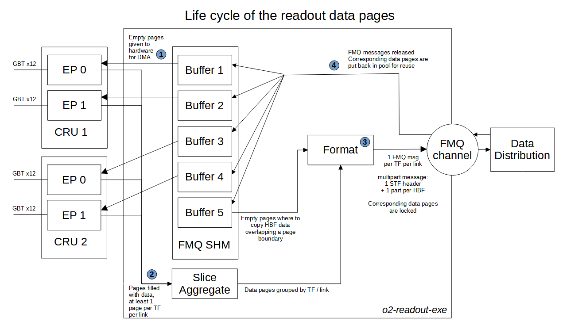

# Readout memory buffers layout

Here is a typical buffer organisation for a production FLP:
- there is one buffer per CRU end point or CRORC channel, providing empty data pages (superpages) to the hardware for DMA transfer from the readout card to the computer memory.
- there is one special buffer for the FMQ channel to Data Distribution, to copy data which overlap several data pages to a single block of memory. Data Distribution requires that data from a HeartBeatFrame (HBF) is shipped in a single FMQ message part.
- the buffers can be allocated from different sources (heap, hugepages, FMQ unmanaged shared memory). In production, all buffers are allocated from a single big block of FMQ SHM, in order to transfer data between processes (mostly) without copy.

All buffers and data transfer operations are independant one from the other. If a single buffer gets full, the FLP system can be affected with different symptoms: CRU packets dropped, incomplete timeframes, data synchronization or consistency issues.

Each buffer is a contiguous block of physical memory, cut in pages of same size. There might be some space reserved between the pages (used for byte alignment, headers, or runtime metadata). Buffers are circular, pages are used in the order they are put in the buffer. On startup, the pages are in the order of their memory address. Buffer and pages size should be adapted to the throughput and data pattern at runtime.

In case of some "buffer low" issues, there are 3 log messages for each episode:

1) "buffer usage is high", when reaching 90% usage.
2) "buffer full" at 100% usage.
3) "buffer back to reasonable" when down to below 80% usage.

When one of the buffer is full, other messages will start to appear, depending on the context (no page left, packets dropped, etc).

## Lifecycle of memory pages

The following figure illustrates the lifecycle of memory pages on a typical FLP:

1) Empty superpages are given to ROC library for CRU/CRORC DMA transfer. The actual runtime queue size of free pages held by ROC library is shown in Readout startup logs by message `ROC input queue size =...`. Typically around 1000 pages for CRU and 128 for CRORC.

2) Filled superpages are retrieved from the ROC library ready fifo, after data have been transfered to them from CRU/CRORC. A superpage contains data of only timeframe and one link, and a timeframe can span multiple pages for a given link. This means that if 24 links are active at standard timeframe rate (88Hz), superpages are used at a rate of at least 2kHz for one CRU. Readout groups the superpages by timeframe and link.

3) Readout creates FMQ messages from superpages by splitting them in smaller parts, according to DataDistribution interface requirements: 1 FMQ multi-part message per timeframe per link, with 1 STF header (metadata) + 1 distinct part per HBF. If one HBF spans accross two superpages, Readout copies the corresponding data to a fresh page (from a special buffer) to create the corresponding message part from a single memory block. At the output of Readout the superpages are not visible any more, this is just a stream of FMQ messages, with each FMQ message part being a small subset of a superpage. This superpage is locked until all FMQ messages pointing to it have been released. (NB: Readout supports other datapage/FMQ message mappings, like 1 FMQ message per data page, with less CPU overhead - directly proportionnal to number of FMQ message parts).

4) DataDistribution releases FMQ messages after use. The data pages are put back in their origin buffer when all corresponding FMQ messages have been destroyed. The time spent between 3) and 4), when DD holds the FMQ message parts (and hence the corresponding superpage) is measured by Readout and plotted in the Readout Monitoring dashboard `Memory pages` plot, `release latency`. A healthy system should have a small release latency (<1s). If the latency is long, the buffers can run out of available superpages for ROC DMA or HBF copy, and some data gets lost.

## Optimization of memory buffers
Considerations to make good use of the FLP memory and tune the corresponding Readout parameters:
* Superpage size for DMA
	* It should be big enough to limit the number of DMA transactions on the PCI bus and maximize throughput. Too small size will reduce the effective transfer rate.  Sizes above 100-200kB are already good .
	* It should not be too large compared to TF size per link, because the CRU changes page on each new TF. E.g. if one set a superpage size of 2MB when the TF size is only 1MB, half of the memory will be lost for each page used. On the other hand, selecting a page size of 10% of TF size guarantees not more than 10% of the memory is unused - but increases the page rate by 10.
	* In practice, a page size of 256kB seems to be a good compromise able to accomodate most data taking conditions.
* Superpage size for fmq-consumer
	* this is the buffer used to copy overlapping HBF for FMQ-DD transfers. The size should match the expected maximum HBF size. If it is too small, corresponding data will be lost. If it is too big, memory is lost. Making it the good size allows to maximize the number of pages for a given memory buffer size (usually, about the same as the one allocated for 1 DMA buffer).
	* the good way to evaluate this parameter is too look at readout logs and see what is the maximum actual size used for this buffer after some reference runs, and add some 50% margin. The current parameters have been set based on initial detector tests, and can be reevaluated any time with the same method.

The readout memory parameters are not critical in most conditions. Tuning them may help to handle high peak loads (e.g. in case of bursts in rates) or handle startup setup time for the processing system to reach a stable state. It will however not solve issues where the output system can not cope with the input rate or when it degrades over time, it will just delay the appearance of the symptoms.
